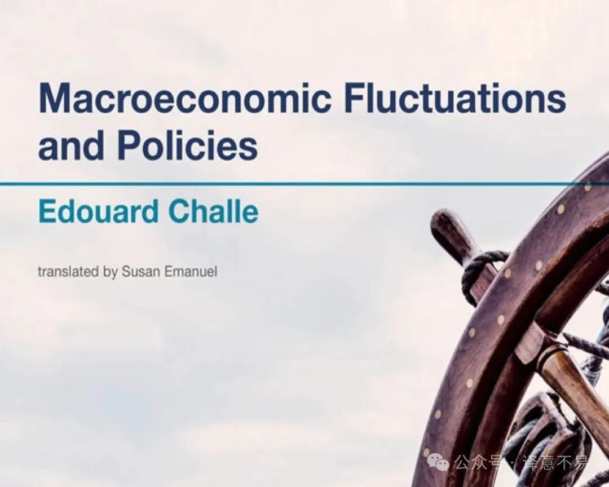
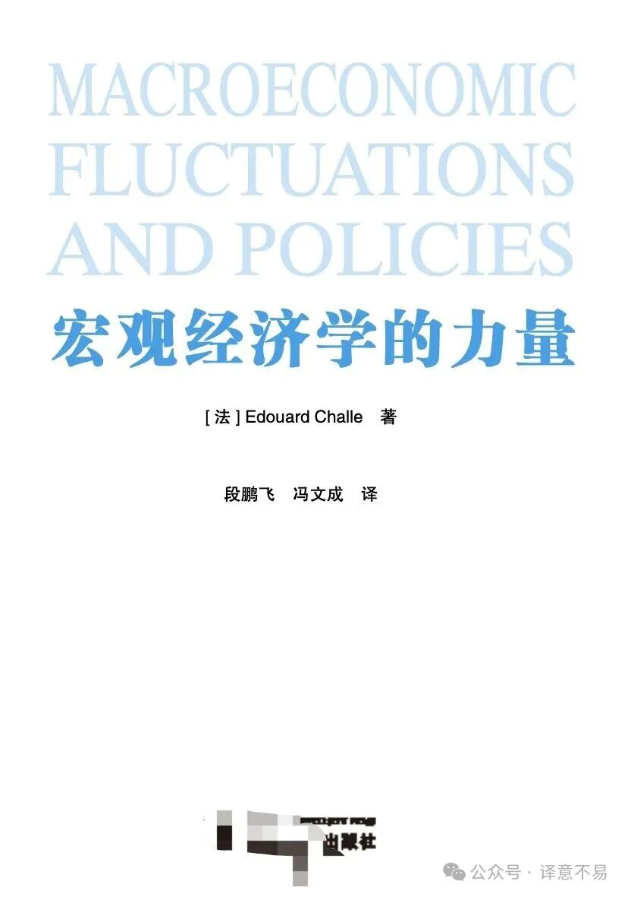
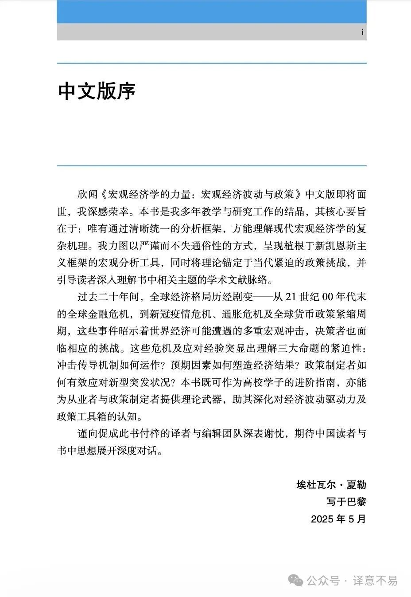

# Challe：宏观经济学的力量

我们从2022年年中开始翻译这本书，断断续续历时两年多，直到2024年底翻译完成初稿。当时翻译这本书的初衷是一边翻译一边学习，并未想到有可能公开出版。在这两年多的边译边学的过程中，越来越觉得这是一本非常出色的宏观经济学教科书，同时也是一本与真实世界紧密联系的政策指南式专著。如果就静静地躺在我们的电脑中，实在是有些愧对这本好书。但由于两位译者都是比较佛系的小人物，就没有努力去寻找出版渠道，因此也就一直搁置了出版事宜。

一晃到了2025年，在出版界一位伯乐的大力支持下，将此译稿交与了某出版社。由于我们二人习惯使用LaTeX工作，这样形成的稿件给出版行业习惯的排版工作带来不少麻烦，所以在2025年年中我们拿到清样并校改、返回给出版社后，没好意思再催促出版方，他们一定是付出了相当多的辛苦进行转换、也可能承受了相当多的各方压力。日前出版社传来消息，言道该书有望近期付印，我们为这本好书能以中文面世感到非常高兴。我们两位译者也没有能力做什么宣传，又实在不忍心这一本好书被埋没，就胡乱写了篇个公号软文，推荐一下这本书。推荐方式非常原始，我们列出2025年年中出版社发给我们的封面清样和原作者Edouard Challe自己撰写的中文版序言的截图，先做个预热。

因为我们不敢确认这书最终是否真能付印，所以暂时隐去了出版社的名字。但这一行为绝对隐不去我们对出版社和那位帮助我们的编辑深深的感激之情。我们和我们的朋友们一起期待这本书的面世吧。