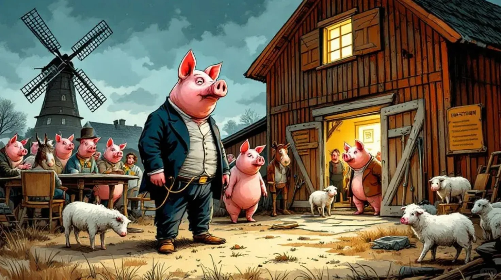

# 《动物农场》解说（1）

《动物农场》是乔治-奥威尔的一部寓言式中篇小说，是一则入木三分的反乌托邦的政治讽喻寓言，通过一群农场动物推翻农场主的故事，探讨了极权主义、理想的堕落以及语言的力量等主题。故事情节非常简单，农场的一群动物成功地进行了一场“革命”，将压榨它们的人类农场主赶出了农场，建立起一个平等的动物社会。然而，动物领袖们，一些聪明的猪，最终却篡夺了革命的果实，成为了比人类更加独裁和残暴的极权统治者。据奥威尔说，故事是影射了1917年俄国（十月）革命前后的一系列事件，以及在革命成功后苏联的斯大林时代。奥威尔是一个社会民主主义者，他认为斯大林领导下的苏联是一个建立在个人崇拜的基础上，并通过恐怖的统治手段得以运转的独裁政权。
	
奥威尔最知名的作品有《动物农场》和《1984》两本书，出版更晚的《1984》读起来让人压抑、沉重，而《动物农场》这本小书读起来则轻松有趣。我在孩子很小的时候就推荐给TA当成童话故事来看。我曾固执地认为，任何年龄段的人都可以看得懂这本小书，却可以各有会心所得。幼儿园时期的小朋友，不妨当一本动画书来看。长大一点就从这是一本影射之作的角度来看。当然，如果再长大些，似乎也可以将眼界超越“含沙苏俄的政治童话”这个层级，尽管故事在多个细节上与苏联历史相呼应，但它更意在对任何形式的极权政权发出警示，它所展现的革命胜利后权利被逐步侵蚀、司法公正日渐沦丧的过程，在任何时间、任何地点都可能发生，它始终是在提醒读者，一个社会何等轻易便会落入独裁者的掌控之中。

	

本着“不能说给自家孩子的话，也不应该说给别人家孩子”的基本准则，我就做一件“既然能够推荐给自家孩子（虽然她未必读），当然也可以推荐给别人家孩子”的事儿，向同学们推荐一下这本书。目的当然是希望“多一个人看奥威尔，就多了一份自由的保障。”
	
今天的第1讲先分享本书第二章中动物们革命成功后（书中的情节是赶走了人类农场主Jones先生之后），动物们给自己制定了行为准则，列出了“七诫”：
	
1. Whatever goes upon two legs is an enemy.
	
2. Whatever goes upon four legs, or has wings, is a friend.
	
3. No animal shall wear clothes.
	
4. No animal shall sleep in a bed.
	
5. No animal shall drink alcohol.
	
6. No animal shall kill any other animal.
	
7. All animals are equal.
	
这七条诫律很有意思，农场自治的后期，随着故事的进展，这些条目都一点点发生了微妙的变化。比方说第5条“凡动物皆不可饮酒”慢慢变成了“凡动物皆不可饮酒过量”。大家不妨猜一猜第7条，“所有动物生来平等”，会怎么被“修正”呢？。我们的生活中不也是常常被宣传“人人生而平等”吗？你能感觉到这种平等吗？#极权主义