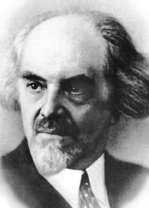

# 歪批《动物农场》（5）

今天开始第二章。这是整部小说真正进入“革命实践”的章节。第一章还停留在“思想动员”和“革命理论”，第二章则开始回答： 革命为什么会突然爆发？  是谁在组织组织革命？  又是谁真正掌握了革命的胜利果实？这一章实际上浓缩1917年俄国革命、沙皇政权崩溃、布尔什维克夺取了政权以及革命初期的理想主义、新政权的诞生等。奥威尔在这一章写得非常精细，很多看似简单的动物行为，其实都在影射真实历史。

在开始这一讲之前，我们先回顾一下上一讲的配图，别尔嘉耶夫，他是何方神圣？我们在网上搜索一番：别尔嘉耶夫（ Nicolas Berdyaev 1874-1948），具有世界影响的俄罗斯宗教哲学家，思想涉及哲学、宗教、文学、政治、人类学和伦理学等领域，被誉为“二十世纪的黑格尔”，“现代最伟大的哲学家和预言家之一”， 俄国给予世界思想界的“第四件礼物”。著述等身，《自由的哲学》、《历史的意义》、《创造的意义》、《人的使命》、《人的奴役与自由》、《俄罗斯思想》等都是其重要著作；以陀思妥耶夫斯基为主要思想源泉，创造了“自由基督教”哲学。1922年被苏俄当局驱逐......

	

这一大长串的介绍，其实重点就在最后他“
被当局驱逐
”这一句，苏联当局之所以驱逐他，理由是别尔嘉耶夫“已经不可能转向共产主义信仰”。也就是它在思想上从原本的马克思主义者转向了唯心主义，直至最终皈依了宗教。他对苏联社会制度的反思与批判，是颇值得“驱逐”的。

好了，还是继续看动物农场里的故事吧。

老Major在讲演结束三天之后，睡梦中平静地离开了这个世界。但是激动人心的讲演必然会播下不安的种子。此后的三个月里，农场中出现了不少秘密活动，一些比较聪明的动物接受了Major的理念。虽然他们无法确定什么时候会发生造反行动，但是要为此做好思想准备、做好宣传、培训人才队伍则是责无旁贷的。这个重担就落在了最聪明的动物--猪的身上了。

说到猪这种动物，我小孩儿现在独自在外求学，生活过得比较拮据。偶尔会下决心买点猪肉吃就开心得不得了，总是说，猪这种动物可真好，全身都是宝。可怜的娃儿。不过，娃儿是说对了的，据科学家说猪确实是动物中比较聪明的。但不知道为什么坊间对于这么好的动物却总是缺乏应有的敬意。奥威尔选了猪作为农场的最高管理阶层，恐怕也是没有什么敬意的，也许是在社会意义上影射某些读书人，知书识理，但却好吃懒做、不劳而获？虽然这些人因为读了些书，也许能算得上是先知先觉，并常以要带动后知后觉者或不知不觉者为己任，但是在获取了敬意的同时，也滋生了特权、僭妄。农场里的猪们就是如此。具体地说，有三头重要的公猪要正式出场了。

第一重要的角色是一头样貌凶猛、不苟言笑且素有主见的公猪，名叫拿破仑Napoleon。此猪虽名为拿破仑，可不是影射法国皇帝拿破仑，而是斯大林的化身。斯大林就是一个严肃的人，他身材粗壮，沉默寡言，也很固执。他的战友兼政敌托洛茨基在自己的回忆文章中这样评价斯大林：“十月革命时期，斯大林......在与从列宁起的那些杰出人物的关系中，变得多疑，并常怀嫉妒。在政治局里，他几乎总是沉默寡言，神情阴郁。”

托洛茨基何许人也？其实就是由本书中与Napoleon同时出场的另一头公猪所影射的，不过他在书中的名字叫Snowball。这个名字在不同的中译本各有不同译法，有音译为斯诺鲍的，有意译为雪球、雪团的。为免误解，还是坚持用其原文Snowball算了。既然说到牠是影射了托洛茨基，那也应该对它做个简要的人物介绍。据说托洛茨基颇具诗人气质，口才好，文笔优美，能够在追随者中产生巨大的号召力，是天生的鼓动者和演说家。列宁也在自己的遗嘱中说，托洛茨基是党内最有才华的人。他1897年出生于一个犹太家庭，早在中学时代就参加了学生运动，后来长期在国外从事反对沙俄的革命活动。在1917年7月举行的俄共第六次代表大会上加入布尔什维克，当选为中央委员。国内战争时期主持东部战事，有“红军之父”的称号。他精明能干，有军事才能和演讲天才，但过于自负、锋芒毕露。最终在党内政治斗争中惨败给了斯大林（开除党藉、流放国外等）。在动物农场中，Snowball和Napoleon一同出场，其人物关系最终走向也恰如真实人类世界中托洛茨基与斯大林关系的走向。

三头重要的公猪中最后一名是Squealer。书中对牠的描述很有喜感。先说这名字，我看过几个中译本，都感觉译得不理想（也是没办法的事）。有音译为“斯奎拉”、“史德勒”的，这没啥好说的，就是个名字，有个音似也行了。还有意译为“声响器”的，这个就不够理想，尤其是在中文世界中，这好像不太像个人名或动物名。Squealer这个英文词确实有声响器的含义，但是也有“告密者”、“打小报告的人”之类的含义。作者用这么个词给牠命名，一定是有些深意的，所以其含义还是偏向于告密者这种吧。这从作者对牠外貌和行为特征的描述中也能看出些端倪：

“一头短小而肥胖的猪......长着圆圆的脸，眼珠子叽哩咕噜地乱转，动作敏捷，嗓音尖细，是个不可多得的演说家。尤其是在阐述某些艰深的论点时，习惯性动作是边讲解边来回不停地蹦跳，同时还不停地甩动着尾巴。这些招数不知怎么搞的还就是挺有蛊惑力。别的动物提到Squealer时，都说牠能把黑的说成白的”。例如，他可以用充满感情的英雄式口吻描述鲍克瑟的 “就义”—— 其实根本不是那么回事，事实上，鲍克瑟是被卖给用动物皮制作胶水的工厂了，它被宰杀用来熬胶水了。

看看这样的人物描写，是不是译成“声响器”不如“小广播、大喇叭”或者“说谎精”更传神？当然这些也不太像个人的名字，所以还是直接用原文Squealer吧，哪怕是用音译也好些。名字这东西就是代号，不做过多解释也罢。我还是个青椒时，系里有位老教师，名叫吴公正，我们总不会因此而联想到他是“没有一个公正之心的人”吧？（其实他人非常非常好的。）当然，Squealer这个角色确实还是有些隐喻的。现实生活中对照一下其实也不乏这类人物。当然，在小说中影射的是拥护斯大林的苏共党内高层的化身，身上可能集合了布哈林、莫洛托夫、亚戈达、叶若夫、贝利亚等人的影子，代表了斯大林政府的虚假宣传与造谣行径。这类行径包括频繁篡改历史、伪造数据，并利用种族主义与民族主义来压制持不同意见者，以巩固斯大林的权力，这其实正是极权主义政权宣传的核心要义。在书中后文的故事进展中，Squealer充分发挥了他“能把黑的说成白的”的特长，为拿破仑立下了汗马功劳。

这三头猪用心琢磨老Major的训导，并将其整理升华成为一套完整的思想体系，名之为“动物主义”（Animalism）。在Jones先生入睡后，牠们就开始秘密集会向其他动物们宣传这套主义。这套主义要说是影射了啥，其实我也不用（也不敢）多说了。1900年列宁从流放地回来后，就与普列汉诺夫、马尔托夫等人合作编辑出版《火星报》，为在俄国建立新型无产阶级政党而努力。1903年7月8日俄国社会民主工党召开第二次代表大会，在选举中央领导机关时，党内分成两派，拥护列宁的多数派被称为布尔什维克，拥护马尔托夫的少数派被称为孟什维克。以列宁为核心的布尔什维克提出一套独立的纲领、路线和策略，它标志着一种崭新的革命思潮---布尔什维克主义问世。1915年8月列宁在《论欧洲联邦口号》一文写道：“经济政治发展的不平衡是资本主义的绝对规律。由此就应得出结论社会主义可能首先在少数或者甚至在单独一个资本主义国家那获得胜利。”

这套动物主义的宣传起初并不是那么顺利的。比方说，至少有的动物会认为，“是Jones先生喂养着我们，如果他走了，我们会饿死的”。对于诸如此类的问题，领导猪们需要怎样下一番功夫说服或教导他们呢？下次更新我们来解决这个问题。
